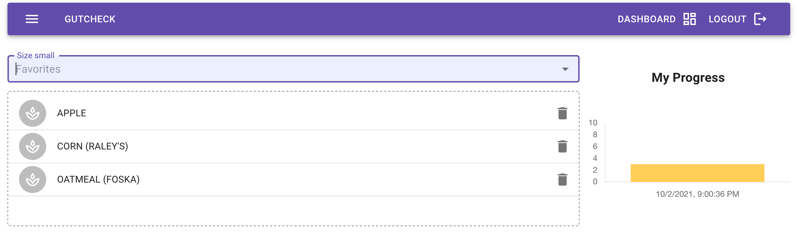
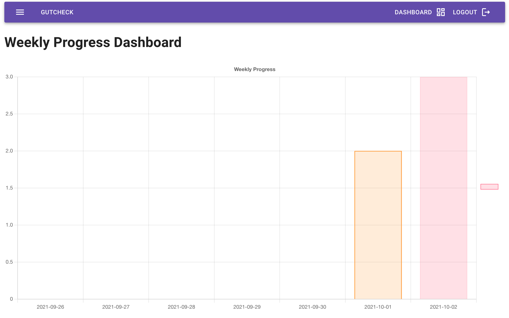
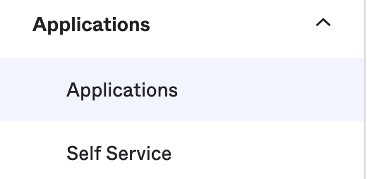
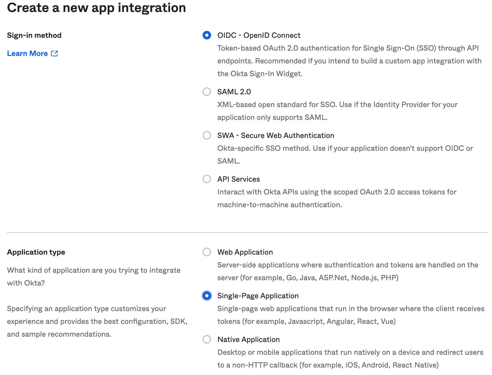
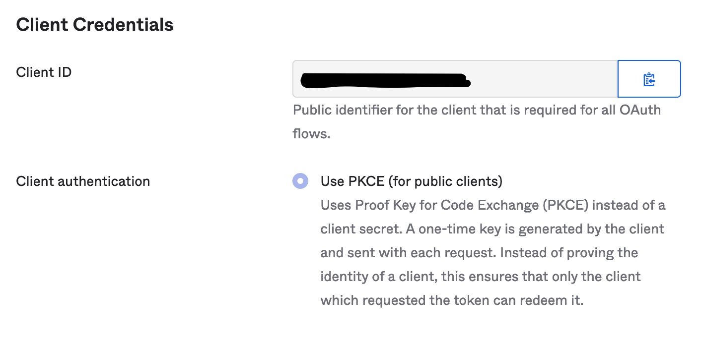
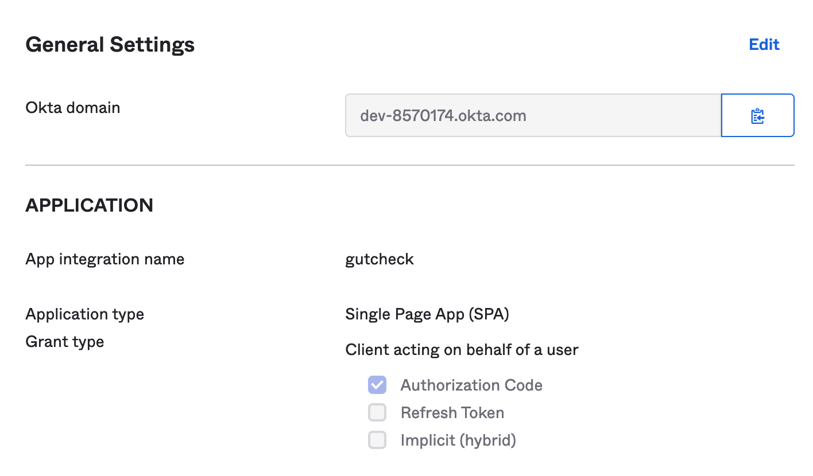
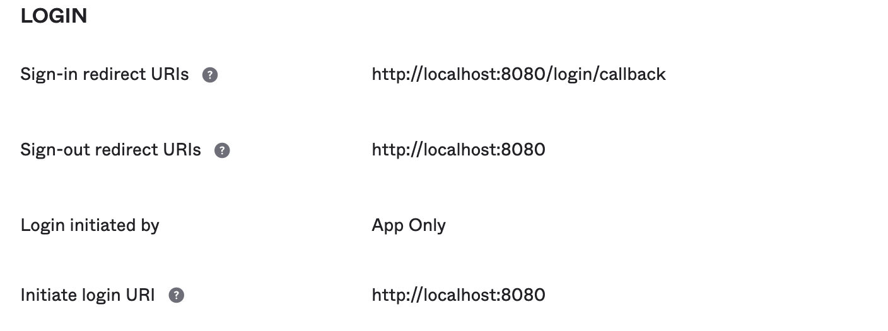
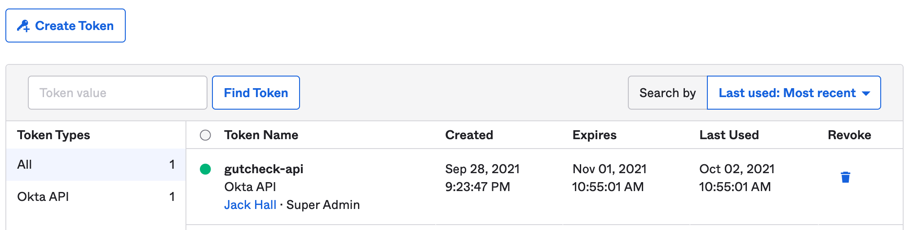

# gutcheck

An app to track fiber variety. [Read the science here.](https://www.sciencedaily.com/releases/2018/05/180515092931.htm)




## Technologies

Gutcheck consists of a React client and a Node/Express backend with PostgreSQL. Additional technologies used include:

- Chart.js for data visualization
- Okta for authentication/authorization
- Sequelize (ORM)
- Material UI
- USDA API

## Setting up the project

1. Clone the repository

```sh
git clone https://github.com/team-axolotl2021/gutcheck.git
```

2. Install dependencies

```sh
yarn
```

3. Run the dev server. (Note: Environment must be fully configured. See below.)

```sh
yarn dev
```

## Environment

We must first establish the necessary environment variables in `.env.example`. This application requires several environment variables to contain valid values in order to properly function.

First, rename the `.env.example` file to `.env` so that it is readable by the `dotenv` library.

### Authentication

Gutcheck uses Okta to provide authentication/authorization functionality.

1. Set up a free Okta developer account. https://www.okta.com/free-trial/
2. From the dashboard, select `Applications` in the left navigation menu.
   
3. Select `Create App Integration` and choose `OIDC - Open ID Connect` as the sign-in method.
4. Select `Single Page Application` as the Application Type
   
5. You will be taken to the Application Dashboard. Take the `Client ID` and supply it to the .env.example file in under the variable name `OKTA_CLIENT_ID`
   
6. On the same page, the first field under `General Settings` contains the Okta domain. Take this value and place it after the `https://` in the environment variable `OKTA_ORG_URL` in .env.example.
   
7. In the Okta settings, ensure that the login section appears as follows:
   
8. In order to verify tokens, Okta requires an API token that allows the Express server to communicate with the Okta domain. From the dashboard, in the left navigation, locate the `Security` header and select the `API` link.
9. Under the tokens tab, select `Create token`. Give the token a descriptive name and click `create`. SAVE THIS TOKEN -- you will not see it again. Place the token in `.env` under the variable name `OKTA_API_TOKEN`.
   

Authentication should now be functional.

### Database (PostgreSQL)

PostgreSQL may be setup locally or using a remote database solution. A popular, free solution can be found at https://www.elephantsql.com/.

#### Remote Database

Remote database setup will vary depending on the provider, but in all cases you should end up with a connection string that resembles the following format:

```
postgres://<username>:<password>@<postgres hostname>/<database>
```

1. Place the connection string in the `PG_URL` environment variable in the `.env` file.

#### Local Database

Local database setups will vary widely, but can be categorized into two general categories: containerized databases or local postgres service. In the containerized scenario, an important consideration will be to ensure that the service port is exposed. In either case, there are a number of variables that must be supplied instead of `PG_URL`. Further, a minor refactor of `sql/sequelize.js` is required.

1. Modify `.env` and supply the following environment variables:

```
PG_DATABASE=
PG_HOSTNAME=
PG_USERNAME=
PG_PASSWORD=
```

2. Modify `sql/sequelize.js`.

```js
// replace this line
const sequelize = new Sequelize(process.env.PG_URL, { dialect: 'postgres' });

// with the following
const sequelize = new Sequelize(
  process.env.PG_DATABASE,
  process.env.PG_USERNAME,
  process.env.PG_PASSWORD,
  {
    host: process.env.PG_HOSTNAME,
    dialect: 'postgres',
  }
);
```
